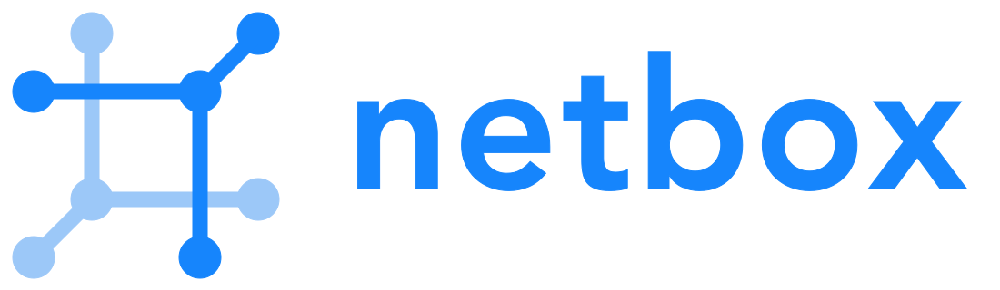

<!--
**talha700/talha700** is a ✨ _special_ ✨ repository because its `README.md` (this file) appears on your GitHub profile.

Here are some ideas to get you started:

- 🔭 I’m currently working on ...
- 🌱 I’m currently learning ...
- 👯 I’m looking to collaborate on ...
- 🤔 I’m looking for help with ...
- 💬 Ask me about ...
- 📫 How to reach me: ...
- 😄 Pronouns: ...
- ⚡ Fun fact: ...
-->

### Hey!, Iam Talha 👋 

Self taught software developer from Pakistan focused on writing Network Automation & System Integration software.
My keen interest remains in building robust and scalable Back-End applications using Python.

## Tools I Use

             

## Routing & Switching
I have a strong computer networking background and a hands-on experience with Cisco and Palo Alto products
#### Known technologies:
  - VLAN | Inter-VLAN Routing
  - STP
  - OSPF | BGP | EIGRP | RIP
  - IPsec
  - DMVPN
  - MPLS
  - NAT
  - ACL
  - FHRPs
  - COPP
  
---
You can also find me on [Linkedin](https://www.linkedin.com/in/talha-javaid-968182123/),[Twitter](https://twitter.com/talhajaved700) & [Youtube](https://www.youtube.com/channel/UCaUXNbVcXY_35SK9xR_wV4A)!

I usualy play Apex Legends when I'm not working :space_invader:.

